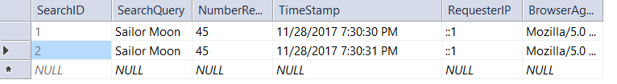

## About Homework 7

In homework 7, the goal was to learn ajax by connecting the Giphy API. The original assignment can be found [here](http://www.wou.edu/~morses/classes/cs46x/assignments/HW7.html) and the code itself can be found [here](https://github.com/mcalawa/senior_project/tree/master/CS_460_Software_Engineering/HW7).

## A Single-Page Web App

Part of the goal of the project was to create an app that was only a single page. In order to do this in MVC, you are required to have, at the very least, one controller, a view, and a script. Additionally, we were required to have some sort of non-default routing in our RouteConfig file and the ability to process Json results. 

Since we needed a non-default route anyway, I decided to have two controllers: a Home controller and a Result controller. The Home controller has the sole purpose of returning a view. The Result controller, on the other hand, is where all the actual work of getting and returning the Json results is accomplished. Since the Home controller doesn't really do anything special, I will start by showing you the Result controller:

```cs
namespace HW7.Controllers
{
    public class ResultController : Controller
    {
        //the database for recording requests
        private SearchLogContext db = new SearchLogContext();

        // GET: Result
        /// <summary>
        /// Returns a view of the HomeController's index, 
        /// since this doesn't actually have any views created.
        /// </summary>
        public ActionResult Index()
        {
            return View("~/Views/Home/Index.cshtml");
        }
```
As you can see, the only thing the Index view of the Result controller does is return the view of the Home controller's Index. The Home controller's Index is relatively simple and can be seen below:

```html
<!--The form for searching for gifs-->
<form id="gifSearch">
    <!--The input for the query and the number of requested results, as well as a button to submit the request; the button receives
        its commands from the JavaScript file linked at the bottom of the page. The input for the number of results uses min and step
        attributes to make sure the number of requested results is not negative or a non-whole number. It also has a list of defaults
        that are suggested numbers of results to return. The inputs both have a placeholder to tell the user what should be put in them. -->
    <input type="search" id="searchTerm" name="SearchQuery" placeholder="Search Query" /> <span id="colorChange">x</span> 
    <input type="number" id="resultNum" name="NumberRequested" placeholder="Number of Results" step="1" min="1" list="defaultNumbers"/>
    <input type="button" id="submitButton" name="search" value="Search"/>

    <!--A list of default, suggested values for number of results to return-->
    <datalist id="defaultNumbers">
        <option value="5">
        <option value="10">
        <option value="15">
        <option value="20">
        <option value="25">
    </datalist>
</form>

<!--Where the results will be displayed-->
<div id="searchResults"></div>

<!--The script for doing all the ajax stuff-->
@section PageScripts {
    <script src="~/Scripts/script.js"></script>
}
```

It just has a form to submit the query, a div to display the results in, and a link to the script that does all the work. When the button is clicked, the following code from the JavaScript is run:

```js
//tells the HTML what to do when the button is clicked
$("#submitButton").click(search);

//the function that runs when you click on the search button
function search()
{
    /* This puts the query into a form that the Giphy API can parse by removing all punctuation 
     * and multiple spaces and replacing each space with a + */
    var query = $("#searchTerm").val().replace(/[\u2000-\u206F\u2E00-\u2E7F\\'!"#$%&()*+,\-.\/:;<=>?@\[\]^_`{|}~]/, "").replace(/\s+/g, "+");
    var limit = $("#resultNum").val();

    //the source of the of the url
    var source = "search?q=" + query + "&limit=" + limit;
    //the ajax call to get the results of the query
    $.ajax({
        type: "GET",
        dataType: "json",
        url: source,
        success: displayResults,
        error: errorOnAjax
    });
}
```

The search function runs the ajax, but in order to do so, it requires two additional pieces of code: the routing from my RouteConfig file to direct it to the correct JsonResult and the actual JsonResult from the Result controller.

```cs
namespace HW7
{
    public class RouteConfig
    {
        public static void RegisterRoutes(RouteCollection routes)
        {
            routes.IgnoreRoute("{resource}.axd/{*pathInfo}");

            routes.MapRoute(
                name: "Search",
                url: "search",
                defaults: new { controller = "Result", action="Search" }
            );
            routes.MapRoute(
                name: "Default",
                url: "{controller}/{action}/{id}",
                defaults: new { controller = "Home", action = "Index", id = UrlParameter.Optional }
            );
        }
    }
}
```
The above code is from the RouteConfig file. As you can see, when the path of the url is "search", the action used is the Search action from the Result controller. Let's look at the Search action more closely, since it is what is running the ajax code for us:

```cs
/// <summary>
        /// The JsonResult that gets everything from the Giphy API.
        /// </summary>
        public JsonResult Search()
        {
            /* The API key isn't actually found anywhere in this project. 
             * It is kept in a config file located outside of the repository
             * and linked to by the Web.config file. */
            string key = System.Web.Configuration.WebConfigurationManager.AppSettings["GiphyAPIKey"];
            /* limit is the number of results to return, which was what I decided to have be the 
             * additional thing that was part of the search instead of just a query to search for.
             * This is especially useful if you are like me and will end up trying to view all of the
             * results returned even though there are a million of them and you have a limited amount of 
             * time. */
            string limit = Request.QueryString["limit"];
            //The search terms we are searching for
            string query = Request.QueryString["q"];

            //The information logging all the searches
            DateTime timestamp = DateTime.Now;
            string userBrowserAgent = Request.UserAgent;
            string ipAddress = Request.UserHostAddress;

            //Creating the search log, so it can be added to the db
            var log = db.SearchLogs.Create();

            log.SearchQuery = query;
            log.NumberRequested = Int32.Parse(limit);
            log.TimeStamp = timestamp;
            log.RequesterIP = ipAddress;
            log.BrowserAgent = userBrowserAgent;

            db.SearchLogs.Add(log);
            db.SaveChanges();

            //The url of the request we are making to the Giphy API
            string url = "https://api.giphy.com/v1/gifs/search?api_key=" + key + "&q=" + query + "&limit=" + limit + "&rating=g&lang=en&fmt=json";

            WebRequest request = WebRequest.Create(url);
            WebResponse response = request.GetResponse();
            Stream responseStream = response.GetResponseStream();
            string reader = new StreamReader(responseStream).ReadToEnd();

            var serializer = new System.Web.Script.Serialization.JavaScriptSerializer();
            var results = serializer.DeserializeObject(reader);

            responseStream.Close();
            response.Close();

            return Json(results, JsonRequestBehavior.AllowGet);
        }
    }
```

The above code gets the search query and the number of results requested and sends the request to the Giphy API so that they can be returned to the JavaScript code I have shared previously. As you might notice, the API key is not actually displayed because it is linked outside of my GitHub repository. This is done through the Web.config file like so:

```config
<appSettings file="..\..\..\..\..\..\..\private\AppSettingsSecrets.config">
    <add key="webpages:Version" value="3.0.0.0"/>
    <add key="webpages:Enabled" value="false"/>
    <add key="ClientValidationEnabled" value="true"/>
    <add key="UnobtrusiveJavaScriptEnabled" value="true"/>
</appSettings>
```

Getting back to the rest of the code, the JsonResult action, Search, then sends the results to the JavaScript and the rest of the JavaScript is run:

```js
/* the function to receive the results of the search, 
 * empty the div that will display them, and then append
 * the results of the function that creates the HTML to display
 * the results */
function displayResults(results)
{
    //this value is still needed because it decides how many results to display
    var limit = $("#resultNum").val();

    $("#searchResults").empty(); //remove the results of previous searches
    //display the results of the current search
    $("#searchResults").append(displayGifs(results, limit));
}

//the function to create the HTML that will display all the gifs
function displayGifs(results, limit)
{
    "use strict";
    //the initial tag the rest of the code attaches to
    var resultContainer = $("<div>");
    /* the div to hold the image and the 
     * image url; currently null since it
     * will be assigned later */
    var divContainer = null;
    /* For the image itself; currently null
     * since it will be assigned later */
    var gifImg = null;
    /**
     * To hold the input text box where we'll have
     * the url of the image's direct link so that
     * the user can access it easily; currently null
     * since it will be assigned later
     */
    var bitly = null;
    //for any br we might need to have
    var brPoint = $("<br>");
    /* Reset the limit to the number of actual results
     * if we end up with fewer results than requested */
    if (results.pagination.count < limit)
    {
        limit = results.pagination.count;
    }

    /* for each of the results we came up with that 
     * are less than or equal to the number of results
     * requested... */
    for (var i = 0; i < limit; i++)
    {
        //create the div to hold the image and url
        divContainer = $("<div>").attr('class', "gifContainer");
        //create the image tag itself with the correct src
        gifImg = $("").attr('src', results.data[i].images.fixed_width.url);
        //append the image to the image/url div
        gifImg.appendTo(divContainer);
        //append the break point to that
        brPoint.appendTo(divContainer);
        //create an input tag for the gif url and assign it a class
        bitly = $("<input>").attr({
            value: results.data[i].bitly_url,
            class: "shortUrl"
        });
        //append the url input to the div
        bitly.appendTo(divContainer);
        //append the img/url div to the container div
        divContainer.appendTo(resultContainer);
    }
    //return the complete result so that it can be displayed
    return resultContainer;
}

// lets the user know if there has been an error
function errorOnAjax()
{
    //write an error message to the console
    console.log("Ajax error");
}
```

Finally, the results are all displayed on the screen. You can see the app in action in the video embedded below.

## A Video Demo

Instead of screenshots, I've uploaded a demo video that shows the completed homework in action. A trigger warning for some body horror, I guess, since one of the things I searched was the excellent philosophical anime series Mushishi and some of the results may have involved animated eyes falling out of heads.

<iframe width="560" height="315" src="https://www.youtube.com/embed/-hVu7lIxGR4" frameborder="0" gesture="media" allow="encrypted-media" allowfullscreen></iframe>

## A Database for Everything and Everything in Its Database

Of course, we also had to include a database to keep track of all the searches that are made. How a database is put together has been covered in previous assignments, so I will just show you proof that the database is working. Here are the database entries from before the video demo was created:



And the database entries after the video demo:

