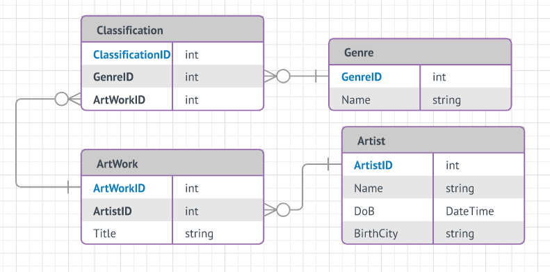

## About Homework 8/9

Homework 8 involved combining everything we had learned so far to create a site with a multi-table, relational database of our own design that included CRUD functionality. The assignment page for homework 8 can be found [here](http://www.wou.edu/~morses/classes/cs46x/assignments/HW8.html). Homework 9 involved deploying the completed homework 8 to the cloud with Azure. The assignment page for homework 9 can be found [here](http://www.wou.edu/~morses/classes/cs46x/assignments/HW9.html). The code for both parts can be found on my GitHub [here](https://github.com/mcalawa/senior_project/tree/master/CS_460_Software_Engineering/HW8).

## Beginning with a Diagram

Since we creating a new database and had not been given a diagram, the first thing that needed to be done was to create an ER (Entity Relation) diagram for the database and then come up with scripts to populate it. The information on the different entities that would be needed and the seed data can be found [here](http://www.wou.edu/~morses/classes/cs46x/assignments/HW8_tables.html). My diagram can be seen below.



We were then required to create the SQL up and down files. We were required to have named constraints in our schema, so the first part of my up.sql file (where the tables are created) looks like the following:

```sql
CREATE TABLE dbo.Artists
(
	[ArtistId] INT IDENTITY (1,1) NOT NULL,
	[Name] VARCHAR(50) NOT NULL,
	[BirthCity] VARCHAR(128) NOT NULL,
	[DoB] DATETIME2 NOT NULL

	CONSTRAINT [PK_dbo.Artists] PRIMARY KEY (ArtistId)
);
```
The Name is only 50 characters because that is one of the later requirements in the assignment. The DoB (date of birth) is a DATETIME2 rather than a DATETIME because SQL DATETIMEs only allow dates after 1752, meaning that if you use a DATETIME, there are a lot of artists you wouldn't be able to enter! Additionally, the C# DateTime type includes both DATETIMEs and DATETIME2s, so using a DATETIME2 doesn't cause any unexpected behavior when creating the corresponding models. If not allowing null values hadn't been part of the assignment, I would have allowed for null values for the date of birth, possibly with a separate field for a circa birth year if the date of birth isn't known, since there are plenty of artists with exact birth dates that are unknown, especially if they were women. One such example is Katsushika Ōi, an [ukiyo-e](https://en.wikipedia.org/wiki/Ukiyo-e) artist and the daughter of Hokusai, who was born sometime in 1800.

```sql
CREATE TABLE dbo.Genres
(
	[GenreId] INT IDENTITY (1,1) NOT NULL,
	[Name] VARCHAR(128) NOT NULL

	CONSTRAINT [PK_dbo.Genres] PRIMARY KEY (GenreId),
	CONSTRAINT [UC_dbo.Genres] UNIQUE (Name)
);

CREATE TABLE dbo.ArtWorks
(
	[ArtWorkId] INT IDENTITY (1,1) NOT NULL,
	[ArtistId] INT NOT NULL,
	[Title] VARCHAR(512) NOT NULL

	CONSTRAINT [PK_dbo.ArtWorks] PRIMARY KEY (ArtWorkId),
	CONSTRAINT [FK_dbo.ArtWorks] FOREIGN KEY (ArtistId) REFERENCES Artists
		ON DELETE CASCADE
		ON UPDATE CASCADE
);

CREATE TABLE dbo.Classifications
(
	[ClassificationId] INT IDENTITY (1,1) NOT NULL,
	[GenreId] INT NOT NULL,
	[ArtWorkId] INT NOT NULL

	CONSTRAINT [PK_dbo.Classifications] PRIMARY KEY (ClassificationId),
	CONSTRAINT [FK1_dbo.Classifications] FOREIGN KEY (GenreId) REFERENCES Genres
		ON DELETE CASCADE
		ON UPDATE CASCADE,
	CONSTRAINT [FK2_dbo.Classifications] FOREIGN KEY (ArtWorkId) REFERENCES ArtWorks
		ON DELETE CASCADE
		ON UPDATE CASCADE
);
```
The Name field of Genres is not the primary key, but it is required to be unique because there is no reason that two different genres would have the same name, such as might be the case with an artist or the title of a piece of art. Speaking of titles, I decided to go with the length 512 just in case anyone wanted to add Salvador Dali's *Fifty Abstract Pictures Which As Seen From Two Yards Change Into Three Lenins Masquerading As Chinese And As Seen From Six Yards Appear As The Head Of A Royal Bengal Tiger*. Finally, the `ON DELETE CASCADE` and `ON UPDATE CASCADE` lets the database know that when the foreign key a table item relies on is deleted or updated, the table item itself should also be deleted or updated.

In the second half of the up.sql file, the tables are populated with seed data:

```sql
INSERT INTO dbo.Genres ([Name]) VALUES
	('Tesselation'),
	('Surrealism'),
	('Portrait'),
	('Renaissance');

INSERT INTO dbo.Artists ([Name],[BirthCity],[DoB]) VALUES
	('M.C. Escher','Leeuwarden, Netherlands', '1898-06-17'),
	('Leonardo Da Vinci', 'Vinci, Italy', '1519-05-02'),
	('Hatip Mehmed Efendi', 'Unknown', '1680-11-18'),
	('Salvador Dali', 'Figueres, Spain', '1904-05-11');

INSERT INTO dbo.ArtWorks ([ArtistId],[Title]) VALUES
	('1', 'Circle Limit III'),
	('1', 'Twon Tree'),
	('2', 'Mona Lisa'),
	('2', 'The Vitruvian Man'),
	('3', 'Ebru'),
	('4', 'Honey Is Sweeter Than Blood');

INSERT INTO dbo.Classifications ([GenreId],[ArtWorkId]) VALUES
	('1','1'),
	('1','2'),
	('2','2'),
	('3','3'),
	('4','3'),
	('4','4'),
	('1','5'),
	('2','6');

GO
```

Next the corresponding models and database context had to be created. As I have discussed creating models and database contexts in previous assignments, I will not include the code for all of the models.

```cs
namespace HW8.Models
{
    public class Artists
    {
        public Artists()
        {
            ArtWorks = new HashSet<ArtWorks>();
        }

        [Key]
        [Required]
        public int ArtistId { get; set; }

        [Required]
        [Display(Name = "Artist")]
        public string Name { get; set; }

        [Required]
        [Display(Name = "Birthplace")]
        public string BirthCity { get; set; }

        [DataType(DataType.Date)]
        [Display(Name = "Date of Birth")]
        public DateTime DoB { get; set; }

        public virtual ICollection<ArtWorks> ArtWorks { get; set; }
    }
}
```

The models in this assignment are similar to ones created for previous assignments with several differences. The most important of these differences is that because this is a multi-table relational database, the model has virtual elements for the first time. In this case, there is a virtual ICollection of type ArtWorks. The reason behind having virtual members is to allow the model to access members of other models based on shared foreign keys. This is what is meant by a relational database. Because these members require other models to work, they must be virtual. Additionally, virtual members with more than one element have to populated at runtime in the constructor.

```cs
namespace HW8.DAL
{
    public class ArtContext : DbContext
    {
        public ArtContext() : base("name=HW8DB")
        { }

        public virtual DbSet<Artists> Artists { get; set; }
        public virtual DbSet<ArtWorks> ArtWorks { get; set; }
        public virtual DbSet<Classifications> Classifications { get; set; }
        public virtual DbSet<Genres> Genres { get; set; }
    }
}
```

As the other model members are similar, I will move onto the database context. The big difference here is that there is more than one DbSet that is part of the database context. As you might have guessed, this is due to having more than one table in the database. Unlike the models themselves, nothing extra is required in the constructor to populate the virtual members of the database context.

## Creating CRUD Functionality for Artists
After creating some list views of the various database tables (which I won't be addressing because I've done so for previous assignments and not much has changed), I needed to create CRUD functionality for the Artists table. CRUD stands for Create, Read, Update, and Delete. Adding CRUD functionality basically means adding the ability to interact with the database tables. 